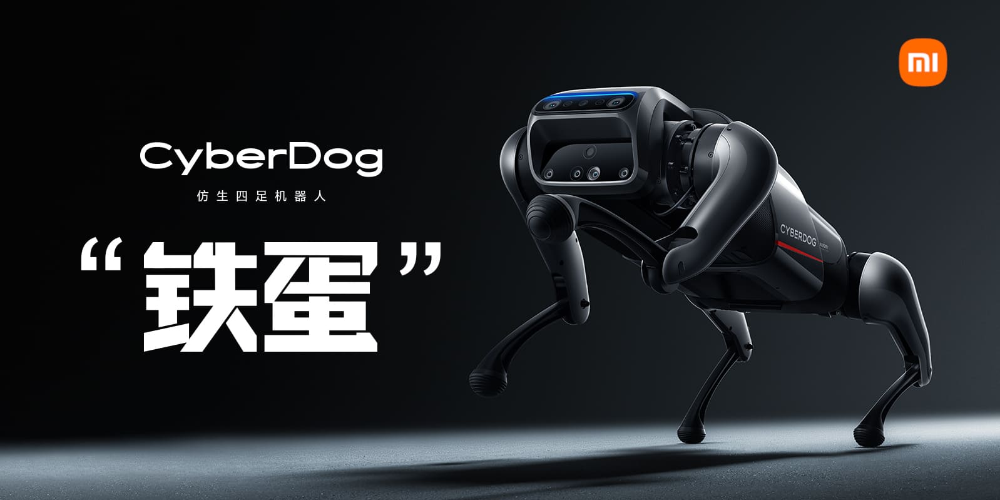

# Xiaomi CyberDog ROS 2

[](https://choosealicense.com/licenses/apache-2.0/)
[](https://github.com/MiRoboticsLab/cyberdog_ros2/actions/workflows/ci_check.yaml)
[](https://telegram.me/cyberdog_mi)



> ***[English](README_EN.md)***

## 简介

本项目包含小米铁蛋®的ROS 2主要功能包. 

## 基本信息

- 铁蛋默认用户是`mi`, 密码为`123`
- 使用USB线连接`Download`接口, 可通过`ssh mi@192.168.55.1`连接铁蛋进行内部操作

## 软件架构

我们基于ROS 2实现了大部分的机器人应用, 如[架构图](tools/docs/soft_arch.svg)所示, 包括多设备链接、多模态感知、多模态人机交互、自主决策、空间定位、导航和目标追踪等功能. 目前使用的DDS中间件是`Cyclone DDS`, ROS 2的版本为`Galactic`. 

由于NVIDIA对Jetson系列截至目前(202109)只提供了Ubuntu 18.04的支持, 故我们对Ubuntu 18.04进行了ROS 2的适配和修改. 具体的修改内容可以通过[mini.repos](tools/ros2_fork/mini.repos)进行拉取, 我们去除了部分没必要的仓, 并添加了一些需要使用的仓库. 

本项目的详细文档都在各个子模块的根目录里, 如有需要可以直接[点击进行了解](https://github.com/MiRoboticsLab/cyberdog_ros2/wiki)

## 前置条件

如在目标设备上直接编译, 需要保证已连接互联网. 首选环境是铁蛋, 次选环境是Docker开发环境. 

如是前者，需要保证执行如下指令：

```
$ apt-get update
$ apt-get install nvidia-l4t-jetson-multimedia-api cuda-compiler-10-2
```

如是后者, 可以考虑使用arm64的Docker. 我们在未来会支持交叉编译。

## 大陆地区加速

如果您在中华人民共和国大陆地区, 可以使用我们提供的Docker的构建加速和colcon的编译加速

> 构建Docker时, 可使用`docker build -t arm_docker:1.0 . --build-arg gfw=1`进行构建镜像, 以提高速度.

> 使用colcon编译包时, 可在colcon编译的语句最后添加`--cmake-args -DBUILD_INSIDE_GFW=ON`以获取加速, 如`colcon build --merge-install --packages-select sdl2_vendor lcm_vendor mpg123_vendor toml11_vendor --cmake-args -DBUILD_INSIDE_GFW=ON`.

## 构建 & 部署

本项目支持两种构建策略:

- 最小功能包: 只编译影响整机启动和运动的相关功能包. 
- 基础功能包: 编译本仓(cyberdog_ros2)的全部功能包. 

### 最小功能包

编译方法:

- 下载`cyberdog_ros2`. 

```
$ mkdir -p ros_apps/src
$ cd ros_apps/src
$ git clone https://github.com/MiRoboticsLab/cyberdog_ros2.git
$ cd ..
```

- 使用`--packages-up-to`编译(确保source过ROS 2的环境变量)

```
$ colcon build --merge-install --packages-up-to cyberdog_bringup
```

或者, 编译到指定目录, 注意: 如有需要请替换`/opt/ros2/cyberdog`的值为其他. 

```
$ export OUTPUT_DIR=/opt/ros2/cyberdog
$ colcon build --merge-install --install-base $OUTPUT_DIR --packages-up-to cyberdog_bringup
```

### 基础功能包

编译方法:

- 下载`cyberdog_ros2`. 
- Download `cyberdog_ros2`.

```
$ mkdir -p ros_apps/src
$ cd ros_apps/src
$ git clone https://github.com/MiRoboticsLab/cyberdog_ros2.git
$ cd ..
```

- 直接编译所有的包(确保source过ROS 2的环境变量)

```
$ colcon build --merge-install
```

或者, 编译到指定目录, 注意:如有需要请替换`/opt/ros2/cyberdog`的值为其他. 

```
$ export OUTPUT_DIR=/opt/ros2/cyberdog
$ colcon build --merge-install --install-base $OUTPUT_DIR
```

此外，小米提供的部分闭源功能包：小爱同学支持默认`不打开`，需要通过在`--cmake-args`后添加`-DXIAOMI_XIAOAI=ON`分别打开两个功能的编译。

### 通用的部署方式

如果使用的是`/opt/ros2/cyberdog`路径进行编译, 且环境是铁蛋, 重启机器或服务即可部署完毕. 

重启服务的方式:

To restart the service:

```
$ sudo systemctl restart cyberdog_ros2.service
```

## 相关项目

- [CyberDog_Ctrl](https://github.com/Karlsx/CyberDog_Ctrl): 使用GRPC控制铁蛋
- [CyberDog_Misc](https://github.com/zbwu/cyberdog_misc): 逆向的铁蛋相关接口和数据

## 相关资源

- [CyberDogAPP下载链接](http://cdn.cnbj1.fds.api.mi-img.com/ota-packages/apk/cyberdog_app.apk)
- [铁蛋躯干Step文件](https://cdn.cnbj2m.fds.api.mi-img.com/cyberdog-package/packages/doc_materials/cyber_dog_body.stp)

## 向铁蛋贡献力量！

浏览页面[CONTRIBUTING.md](CONTRIBUTING.md)了解如何向铁蛋贡献力量！
