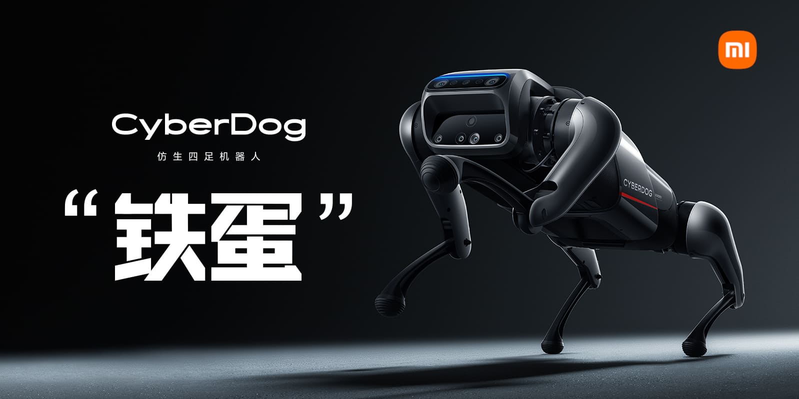

# Xiaomi CyberDog ROS 2

[](https://choosealicense.com/licenses/apache-2.0/)
[](https://github.com/MiRoboticsLab/cyberdog_ros2/actions/workflows/ci_check.yaml)
[](https://telegram.me/cyberdog_mi)



> ***[中文](README.md)***

## Introduction

This project contains the main ROS 2 packages of Xiaomi CyberDog®.

## Basic Information

- The default user of CyberDog is `mi`, default password is `123`
- You can use a USB cable to connect to the `Download` interface, and use `ssh mi@192.168.55.1` to connect to CyberDog for internal operations

## Software Architecture 

Most of the robot applications are implemented based on ROS -As shown in the [architecture diagram](tools/docs/soft_arch.svg), it includes functions such as multi-device connection, multi-modal perception, multi-modal human-computer interaction, autonomous decision-making, localization, navigation, and target tracking. Currently, the DDS middleware in use is `Cyclone DDS`, and the ROS 2 Package is implemented at `Galactic`.

Due to NVIDIA only provides support for Ubuntu 18.04 for the Jetson series (202109) as yet, we have adapted and modified ROS 2 for Ubuntu 18.04. The specific modification content can be pulled through [mini.repos](tools/ros2_fork/mini.repos). We have removed some unnecessary repositories, and added some repositories that need to be used.

The documentation of this project is in the root directory of each submodule. If necessary, read [this page](https://github.com/MiRoboticsLab/cyberdog_ros2/wiki).

## Precondition

If you are directly compiling on the target device, you need to ensure that you have connected to the Internet. The preferred environment is CyberDog, and the second choice is the Docker development environment.

If the former, you need to ensure that the following instructions are executed:

```
$ apt-get update
$ apt-get install nvidia-l4t-jetson-multimedia-api cuda-compiler-10-2
```

If the latter, you can consider using arm64's Docker. We will support cross compilation in the future.

## Build & Deploy

This project supports two construction strategies:

- Minimal package: Only compile the relevant packages that affect the startup and motion of the whole machine.
- Basic package: Compile all packages of this repository(cyberdog_ros2).

### Minimal Package

Building process:

- Download `cyberdog_ros2`.

```
$ mkdir -p ros_apps/src
$ cd ros_apps/src
$ git clone https://github.com/MiRoboticsLab/cyberdog_ros2.git
$ cd ..
```

- Use `--packages-up-to` to compile(Ensure the ROS 2 environment is sourced)

```
$ colcon build --merge-install --packages-up-to cyberdog_bringup
```

Or, compile to the specified directory. Note: If necessary, please replace `/opt/ros2/cyberdog` with your path.

```
$ export OUTPUT_DIR=/opt/ros2/cyberdog
$ colcon build --merge-install --install-base $OUTPUT_DIR --packages-up-to cyberdog_bringup
```

### Basic package

Building process:

- Download `cyberdog_ros2`.

```
$ mkdir -p ros_apps/src
$ cd ros_apps/src
$ git clone https://github.com/MiRoboticsLab/cyberdog_ros2.git
$ cd ..
```

- Compile all packages (Ensure the ROS 2 environment is sourced)

```
$ colcon build --merge-install
```

Or, compile to the specified directory. Note: If necessary, please replace `/opt/ros2/cyberdog` with your path.

```
$ export OUTPUT_DIR=/opt/ros2/cyberdog
$ colcon build --merge-install --install-base $OUTPUT_DIR
```

In addition, some closed-source function packages provided by Xiaomi: Xiaoai support default `not open`, you need to add `-DXIAOMI_XIAOAI=ON` after `--cmake-args` respectively turn on the building of the two functions.

### General deployment method

If you use the `/opt/ros2/cyberdog` path to compile and the environment is cyberdog, restart the machine or service to complete the deployment.

To restart the service:

```
$ sudo systemctl restart cyberdog_ros2.service
```

## Related Projects

- [CyberDog_Ctrl](https://github.com/Karlsx/CyberDog_Ctrl): Control your CyberDog with GRPC
- [CyberDog_Misc](https://github.com/zbwu/cyberdog_misc): Reversed CyberDog related interfaces and data

## Related Resources

- [CyberDogAPP download link](http://cdn.cnbj1.fds.api.mi-img.com/ota-packages/apk/cyberdog_app.apk)
- [Step file of CyberDog body](https://cdn.cnbj2m.fds.api.mi-img.com/cyberdog-package/packages/doc_materials/cyber_dog_body.stp)

## Contribute to CyberDog!

Go through the page [CONTRIBUTING.md](CONTRIBUTING.md) to learn how to contribute to CyberDog!
